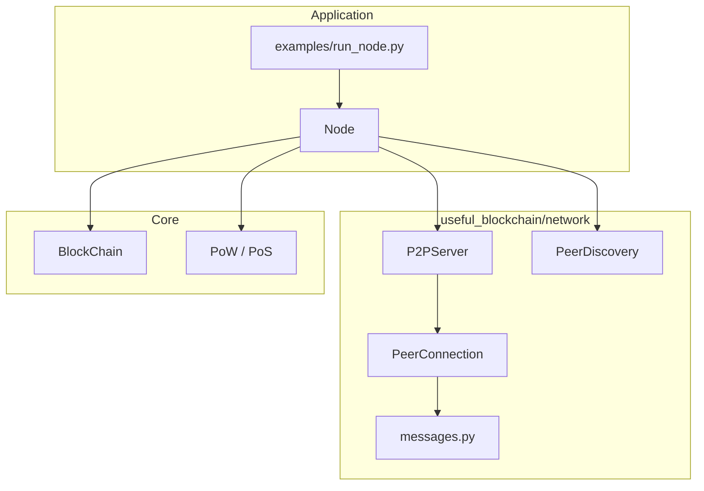
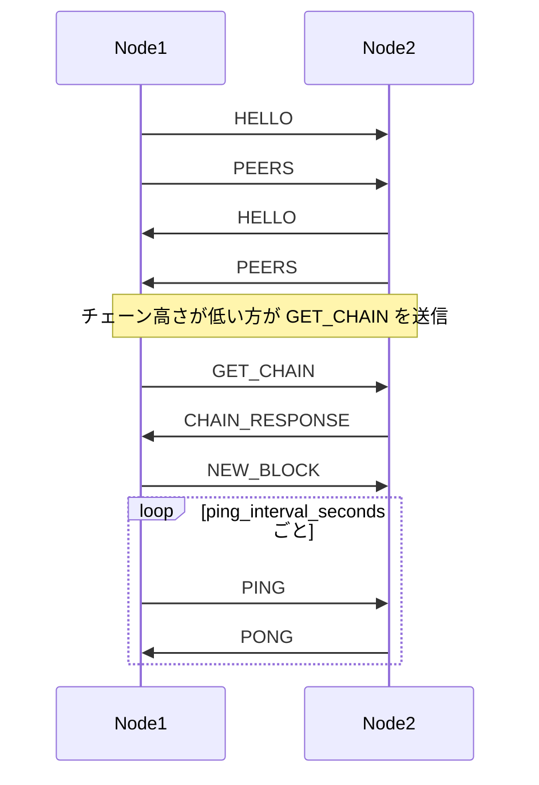

# P2P ネットワーク

easyblockchain v2.0 の P2P ネットワーク層の解説です。分散ノード間でブロックチェーンを共有・同期するための仕組みを説明します。

## 概要

P2P 層は **asyncio + WebSocket + JSON** で実装されています。libp2p や gossip プロトコルは使わず、教育・試作向けにシンプルな設計としています。

| 項目 | 内容 |
|------|------|
| トランスポート | WebSocket（`websockets` ライブラリ） |
| シリアライズ | JSON（既存ブロック形式と整合） |
| エントリポイント | `useful_blockchain.network.node.Node` |
| 起動例 | `examples/run_node.py` |

v1 互換モードの `BlockChain()` 単体利用では P2P は動作しません。分散モードでは `Node` 経由でブロックを追加・同期してください。

## アーキテクチャ



### コンポーネント

| ファイル | クラス | 役割 |
|---------|--------|------|
| `network/node.py` | `Node` | P2P・合意・チェーンを束ねるオーケストレータ |
| `network/server.py` | `P2PServer` | WebSocket サーバー起動、接続管理、`broadcast` |
| `network/peer.py` | `PeerConnection` | 1 ピアとの送受信ループ |
| `network/discovery.py` | `PeerDiscovery` | ブートストラップ + 任意 mDNS |
| `network/messages.py` | `MessageType` | 7 種のメッセージ定義と JSON シリアライズ |

### Node のライフサイクル

**`start()` の処理順序:**

1. `P2PServer.start()` — WebSocket サーバーを起動
2. `PeerDiscovery.start_mdns()` — mDNS が有効なら LAN 内ピアをブラウズ
3. `bootstrap_peers` の各 URL に `connect_peer()` で接続
4. PING ループを開始（`ping_interval_seconds` 間隔）
5. 接続済みピアへ HELLO をブロードキャスト

**`stop()` の処理順序:**

1. PING ループをキャンセル
2. mDNS を停止
3. 全ピア接続を閉じ、サーバーを停止

**`connect_peer(url)` の処理:**

1. 空 URL・自ノード URL・既接続 URL はスキップ
2. `P2PServer.connect_peer()` で WebSocket 接続（`max_peers` 超過時は失敗）
3. 成功時に HELLO を送信
4. 既知ピアリストを PEERS メッセージで送信

## プロトコル仕様

### メッセージ形式

すべてのメッセージは次の JSON 形式で WebSocket 上に送られます。

```json
{"type": "HELLO", "node_id": "...", "consensus_type": "pow", ...}
```

`type` フィールドは `MessageType` 列挙値の文字列です。エンコード・デコードは `encode_message()` / `decode_message()` が担当します。

### メッセージ一覧

| Type | 用途 | 送信側が付与する主な payload |
|------|------|------------------------------|
| `HELLO` | ハンドシェイク | `node_id`, `consensus_type`, `chain_height`, `genesis_hash` |
| `PEERS` | ピアリスト交換 | `peers`（WebSocket URL のリスト） |
| `GET_CHAIN` | チェーン要求 | `from_height`, `requester` |
| `CHAIN_RESPONSE` | チェーン応答 | `blocks`, `node_id` |
| `NEW_BLOCK` | 新ブロック通知 | `block`, `node_id` |
| `PING` | 死活監視 | `node_id` |
| `PONG` | PING 応答 | `node_id` |

### JSON 例

**HELLO（送信）**

```json
{
  "type": "HELLO",
  "node_id": "a1b2c3d4-...",
  "consensus_type": "pow",
  "chain_height": 3,
  "genesis_hash": "0000000000000000000000000000000000000000000000000000000000000000"
}
```

**PEERS**

```json
{
  "type": "PEERS",
  "peers": ["ws://127.0.0.1:8765", "ws://127.0.0.1:8766"]
}
```

**GET_CHAIN**

```json
{
  "type": "GET_CHAIN",
  "from_height": 1,
  "requester": "a1b2c3d4-..."
}
```

**CHAIN_RESPONSE**

```json
{
  "type": "CHAIN_RESPONSE",
  "blocks": [/* Block オブジェクトの配列 */],
  "node_id": "a1b2c3d4-..."
}
```

**NEW_BLOCK**

```json
{
  "type": "NEW_BLOCK",
  "block": {/* Block オブジェクト */},
  "node_id": "a1b2c3d4-..."
}
```

### 通信フロー



### HELLO ハンドシェイクの検証

受信側 `Node._on_hello()` の挙動:

| 項目 | 検証 | 不一致時の動作 |
|------|------|----------------|
| `consensus_type` | あり | warning ログを出し、ピア接続を切断 |
| `chain_height` | 比較のみ | 相手の方が高ければ `GET_CHAIN` で同期 |
| `genesis_hash` | あり | warning ログを出し、ピア接続を切断 |

`genesis_hash` はチェーンが空なら `config/default.yaml` の `genesis.prev_hash`、それ以外は先頭ブロックの `block_header.prev_hash`（なければ設定値）です。同一ネットワーク内の全ノードは同じ `genesis.prev_hash` を設定してください。

## ピア発見

ノードは次の 3 経路でピアを発見します。

### 1. ブートストラップ

`config/default.yaml` の `bootstrap_peers` または CLI の `--bootstrap` で初期接続先を指定します。

```bash
uv run python examples/run_node.py --port 8766 --bootstrap ws://127.0.0.1:8765
```

### 2. PEERS 交換

接続確立後、各ノードは既知のピア URL リストを PEERS メッセージで共有します。受信側はリスト内のピアへ順次接続を試みます（`max_peers` まで）。

### 3. mDNS（任意）

LAN 内の他ノードを自動発見するオプション機能です。

**有効化手順:**

1. 依存をインストール: `uv pip install "useful_blockchain[mdns]"`（`zeroconf>=0.131`）
2. 設定で `mdns_enabled: true` にする

**注意:**

- mDNS は**ブラウズのみ**（他ノードのサービスを探す）。自ノードのサービス登録（advertise）は未実装です
- 発見したピアの URL は `ws://{ipv4}:{port}` 形式
- `zeroconf` 未インストール時は warning ログを出し、P2P はブートストラップのみで続行します

## チェーン同期とフォーク解決

### 同期トリガー

- HELLO 受信時、相手の `chain_height` が自分より大きい
- `NEW_BLOCK` 受信時、ブロック追加に失敗した（`add_block` が `False` を返した）
- `Node.sync_chain()` を明示的に呼び出した

### GET_CHAIN / CHAIN_RESPONSE

1. 要求側は `GET_CHAIN` を送信（`from_height` は常に `1`）
2. 応答側は `blockchain.get_blocks_from(from_height)` でブロック列を返す
3. 要求側は 10 秒以内に `CHAIN_RESPONSE` を待つ（タイムアウト時は warning ログ）
4. 受信したチェーンで `consensus.select_canonical_chain()` により正規チェーンを選択
5. ローカルと異なる場合は `blockchain.replace_chain()` で置き換え

`get_blocks_from(1)` はチェーン全体を返します。`from_height < 1` の場合も全ブロックを返します。

### 新ブロックの伝播

`Node.add_block()` はローカルでブロックを生成したあと、`NEW_BLOCK` を全接続ピアへ broadcast します。受信側は `blockchain.add_block()` で検証・追加します。

## 設定リファレンス

`config/default.yaml`、または環境変数 `EASYBLOCKCHAIN_CONFIG` で指定した YAML ファイルから読み込みます。

### `genesis` セクション

| キー | デフォルト | 説明 |
|------|-----------|------|
| `prev_hash` | 64 文字の `"0"` | 先頭ブロックの `prev_hash` および HELLO の `genesis_hash` 識別子 |

### `network` セクション

| キー | デフォルト | 説明 |
|------|-----------|------|
| `host` | `"0.0.0.0"` | WebSocket サーバーのバインドアドレス |
| `port` | `8765` | リッスンポート（`0` で OS が空きポートを割当） |
| `bootstrap_peers` | `[]` | 起動時に接続するピア URL のリスト |
| `mdns_enabled` | `false` | mDNS ピア発見の有効化 |
| `mdns_service_name` | `"_easyblockchain._tcp.local."` | mDNS サービスタイプ |
| `max_peers` | `25` | 同時接続ピア数の上限 |
| `chain_sync_batch_size` | `100` | **未使用**（将来用。現状は全ブロック一括返却） |
| `ping_interval_seconds` | `30` | PING 送信間隔（秒） |
| `connection_timeout_seconds` | `10` | 発信 WebSocket 接続のタイムアウト（秒） |

`host` が `0.0.0.0` または空のとき、`local_url` は `ws://127.0.0.1:{port}` として報告されます。

## 利用手順

### CLI でノード起動

```bash
# ノード 1（PoW）
uv run python examples/run_node.py --consensus pow --port 8765

# ノード 2（ノード 1 に接続）
uv run python examples/run_node.py --consensus pow --port 8766 --bootstrap ws://127.0.0.1:8765
```

### Python API

```python
import asyncio
from useful_blockchain.network.node import Node

async def main() -> None:
    node = Node(overrides={
        "consensus": {"type": "pow", "pow": {"initial_difficulty": 2}},
        "network": {"port": 8765, "bootstrap_peers": []},
    })
    await node.start()
    print(f"Listening on {node.p2p.local_url}")
    await node.add_block(["alice"], ["bob"])
    await node.stop()

asyncio.run(main())
```

### マルチノード検証スクリプト

3 ノードでの PoW / PoS 動作確認:

```bash
uv run python scripts/verify_multinode.py
```

## 制限事項

本 P2P 実装は教育・試作向けです。本番利用には追加のセキュリティ監査が必要です。

| 項目 | 現状 |
|------|------|
| TLS / 暗号化 | なし（平文 WebSocket） |
| ピア認証 | なし |
| スパム・DoS 対策 | なし |
| gossip プロトコル | なし（単純 broadcast） |
| バッチ同期 | 未実装（`chain_sync_batch_size` は未使用） |
| mDNS advertise | 未実装（ブラウズのみ） |
| 合意種別 | 同一ネットワーク内で PoW / PoS は混在不可 |

## 関連テスト

| テストファイル | 内容 |
|---------------|------|
| `tests/unit/test_messages.py` | メッセージのエンコード・デコード |
| `tests/e2e/test_two_node_sync.py` | 2 ノード PoW 同期 |
| `tests/e2e/test_three_node_pow.py` | 3 ノード PoW |
| `tests/e2e/test_genesis_mismatch.py` | genesis 一致・不一致時の接続 |

```bash
uv run pytest tests/unit/test_messages.py -v
uv run pytest tests/e2e -v -m slow
```

## 関連ドキュメント

- [README.md](../README.md) — プロジェクト全体の概要
- [CHANGELOG.md](../CHANGELOG.md) — v2.0.0 の変更履歴
- [config/default.yaml](../config/default.yaml) — デフォルト設定
